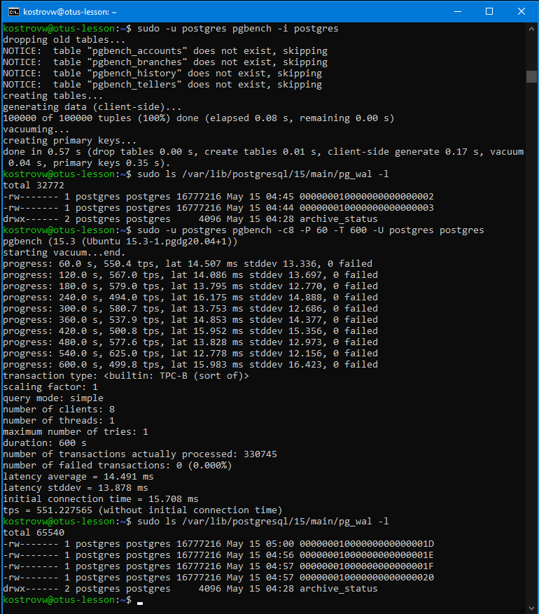
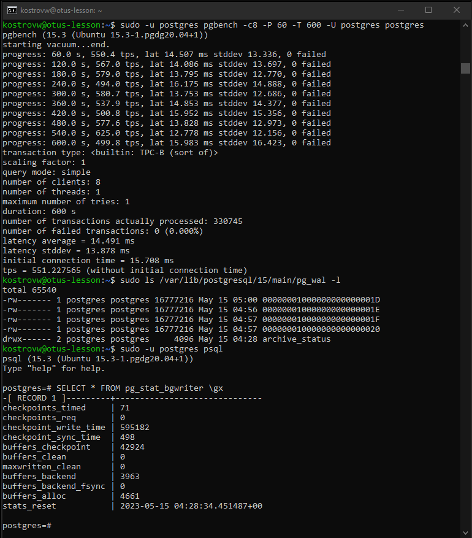
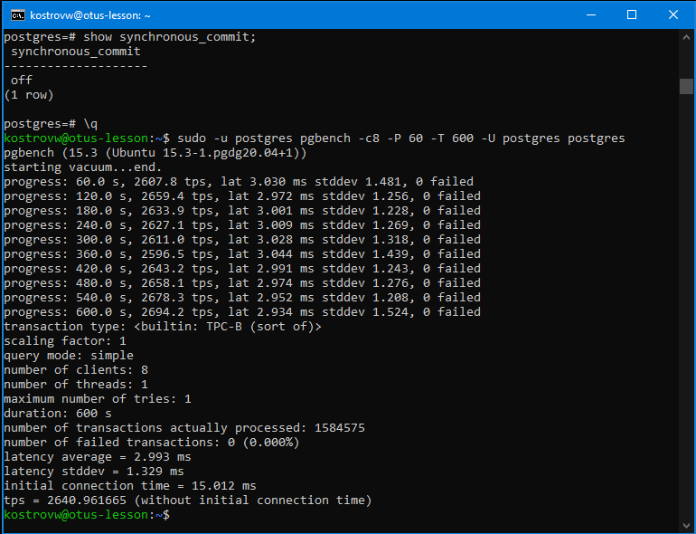
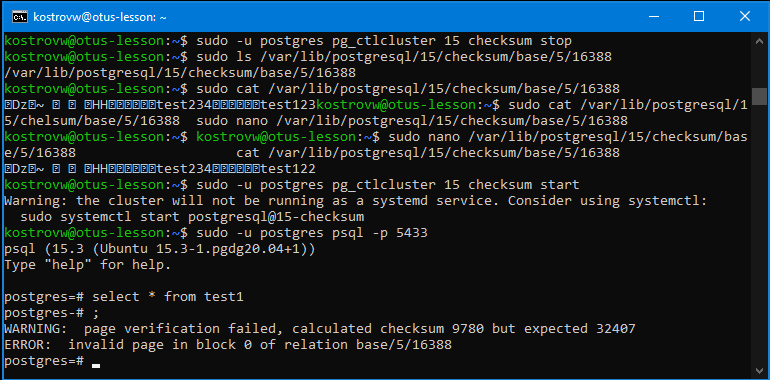
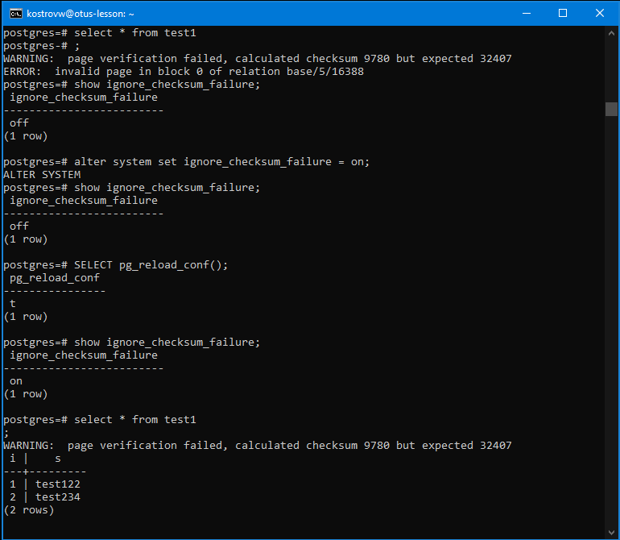

# Занятие 10 (Журналы)

1 Настройте выполнение контрольной точки раз в 30 секунд.

alter system set checkpoint_timeout = 30;

SELECT pg_reload_conf();

2 10 минут c помощью утилиты pgbench подавайте нагрузку.

sudo -u postgres pgbench -c8 -P 60 -T 600 -U postgres postgres

3 Измерьте, какой объем журнальных файлов был сгенерирован за это время. Оцените, какой объем приходится в среднем на одну контрольную точку.

Создано 19*16Mb = 304Mb файлов, 20 контрольных точек. Получается 15,2Mb на контрльную точку

4 Проверьте данные статистики: все ли контрольные точки выполнялись точно по расписанию. Почему так произошло?

SELECT * FROM pg_stat_bgwriter \gx

checkpoints_req = 0 , значит все контрольные точки выполнялись по расписанию. 

30 секунд - достаточно малый период, чтобы не возникало других условий для запуска контрольной точки.

5 Сравните tps в синхронном/асинхронном режиме утилитой pgbench. Объясните полученный результат.

alter system set synchronous_commit = off;

SELECT pg_reload_conf();

551 tps в синхронном режиме и 2640 tps в асинхронном. Асинхронный режим значительно быстрее (выбрано хранилище HDD), за счёт снижения надёжности кластера при сбоях.

6 Создайте новый кластер с включенной контрольной суммой страниц. Создайте таблицу. Вставьте несколько значений. Выключите кластер. Измените пару байт в таблице. Включите кластер и сделайте выборку из таблицы. Что и почему произошло? как проигнорировать ошибку и продолжить работу?

sudo nano /etc/postgresql-common/createcluster.conf

  initdb_options = "--data-checksums"  

sudo pg_createcluster 15 checksum

sudo -u postgres pg_ctlcluster 15 main stop

sudo -u postgres pg_ctlcluster 15 checksum start

sudo -u postgres psql -p 5433

create table test1(i integer, s varchar(25));

insert into test1 values(1,'test123');

insert into test1 values(2,'test234');

SELECT oid, datname, datistemplate, datallowconn FROM pg_database;

select 'public.test1'::regclass::oid;

Ошибка контрольной суммы.

alter system set ignore_checksum_failure = on;

SELECT pg_reload_conf();

Игнорируем ошибку - данные доступны (измененные).

