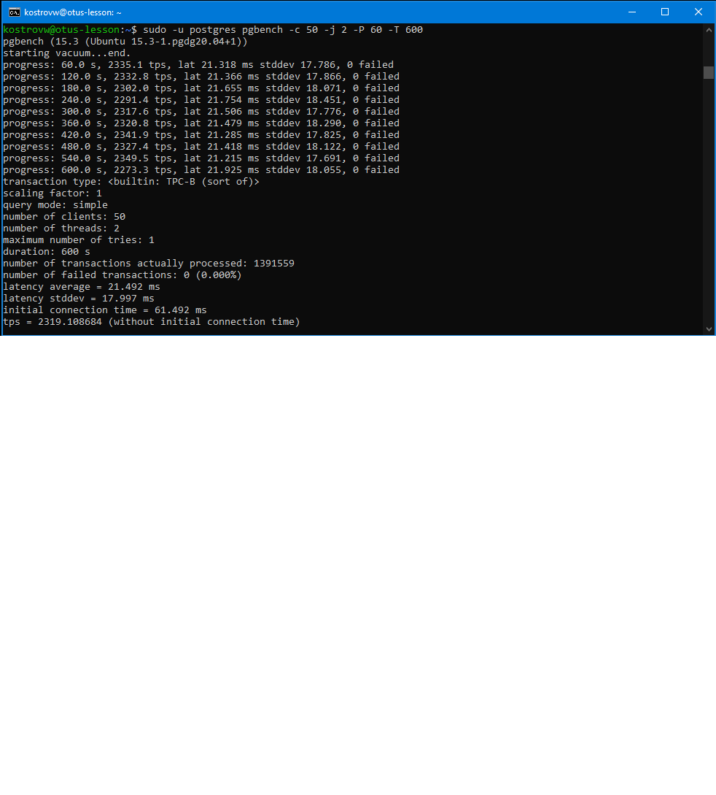

# Занятие 12 (Настройка PostgreSQL)

* настроить параметры PostgreSQL для достижения максимальной производительности
* нагрузить кластер через утилиту через утилиту pgbench
* написать какого значения tps удалось достичь, показать какие параметры в какие значения устанавливали и почему

tps = 2319

max_connections = 100

= референсное значение

shared_buffers = 1GB

= RAM / 4

effective_cache_size = 3GB

= RAM - 1GB (максимум за вычетом на нужды ОС)

random_page_cost = 1.1

= значение для SSD

effective_io_concurrency = 200

= значение для SSD

checkpoint_completion_target = 0.9

= более равномерная запись по всей контрольной точке

wal_buffers = 16MB

= максимальное рекомендованное значение

max_wal_size = 16GB

= увеличенный журнал транзакций между контрольными точками

min_wal_size = 4GB

= минимальный размер тоже пропорционально увеличен

work_mem = 5242kB

= 0,5GB / 100 connections (на рабоче операции)

maintenance_work_mem = 256MB

= побольше для ускорения vacuum

synchronous_commit = off

= отключил синхронную запись. большой прирост в сокрости

* аналогично протестировать через утилиту https://github.com/Percona-Lab/sysbench-tpcc (требует установки https://github.com/akopytov/sysbench)

