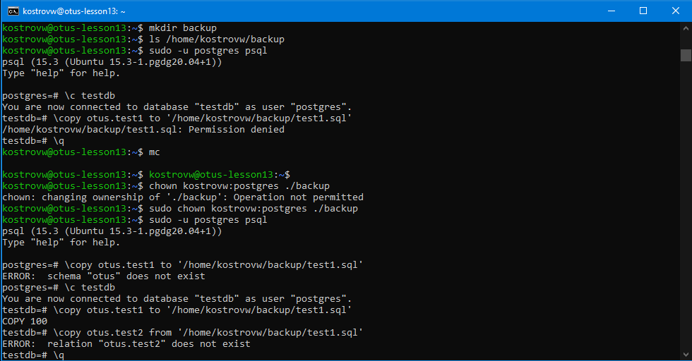
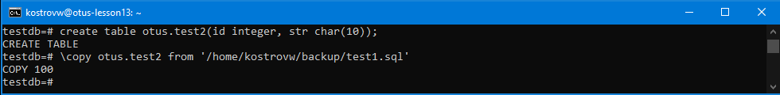
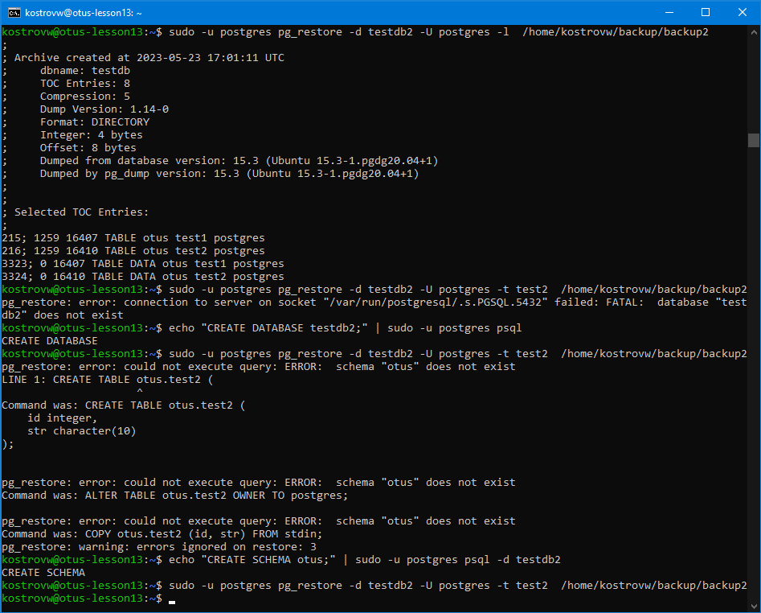
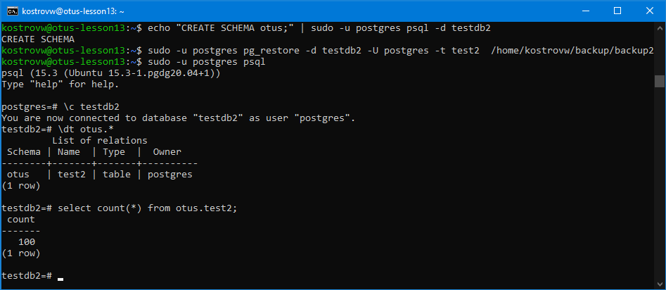

# Занятие 13 (Резервное копирование и восстановление)
* Создаем ВМ/докер c ПГ.
* Создаем БД, схему и в ней таблицу.
* Заполним таблицы автосгенерированными 100 записями.

sudo -u postgres psql

create database testdb;

\c testdb

create schema otus;

create table otus.test1 as

select generate_series(1,100) as id, md5(random()::text)::char(10) as str;

* Под линукс пользователем Postgres создадим каталог для бэкапов
* Сделаем логический бэкап используя утилиту COPY

* Восстановим в 2 таблицу данные из бэкапа.

Таблицу нужно создать.

* Используя утилиту pg_dump создадим бэкап с оглавлением в кастомном сжатом формате 2 таблиц

sudo -u postgres pg_dump -d testdb -U postgres --format=d --table=otus.test[12] -Z 5 -f /home/kostrovw/backup/backup2

* Используя утилиту pg_restore восстановим в новую БД только вторую таблицу!

echo "CREATE DATABASE testdb2;" | sudo -u postgres psql

echo "CREATE SCHEMA otus;" | sudo -u postgres psql -d testdb2

sudo -u postgres pg_restore -d testdb2 -U postgres -t test2  /home/kostrovw/backup/backup2

Схема не восстанавливается сама.

