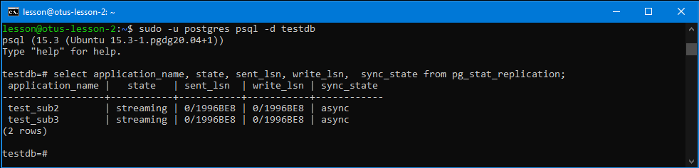

# Занятие 14 (Репликация в PostgreSQL)

* На 1 ВМ создаем таблицы test для записи, test2 для запросов на чтение.

sudo -u postgres psql

create database testdb;

\c testdb

create table test as select generate_series(1,10) as id, md5(random()::text)::char(10) as str;

create table test2 (id integer, str char(10));

* Создаем публикацию таблицы test и подписываемся на публикацию таблицы test2 с ВМ №2.

ALTER SYSTEM SET wal_level = logical;

sudo pg_ctlcluster 15 main restart

sudo -u postgres psql -d testdb

CREATE PUBLICATION test_pub FOR TABLE test;

\password

pas123

CREATE SUBSCRIPTION test_sub2 
CONNECTION 'host=10.129.0.18 port=5432 user=postgres password=pas321 dbname=testdb' 
PUBLICATION test_pub2 WITH (copy_data = true);

--ошибка соедиинения

* На 2 ВМ создаем таблицы test2 для записи, test для запросов на чтение.

sudo -u postgres psql

create database testdb;

\c testdb

create table test2 as select generate_series(1,10) as id, md5(random()::text)::char(10) as str;

create table test (id integer, str char(10));

* Создаем публикацию таблицы test2 и подписываемся на публикацию таблицы test1 с ВМ №1.

ALTER SYSTEM SET wal_level = logical;

sudo pg_ctlcluster 15 main restart

sudo -u postgres psql -d testdb

CREATE PUBLICATION test_pub2 FOR TABLE test2;

\password

pas321

CREATE SUBSCRIPTION test_sub 
CONNECTION 'host=10.129.0.13 port=5432 user=postgres password=pas123 dbname=testdb' 
PUBLICATION test_pub WITH (copy_data = true);

* **нужно открыть доступ для сетевых соединений на обоих ВМ, после чего повторить подписку**

sudo pg_conftool 15 main set listen_addresses '*'

	/etc/postgresql/15/main/pg_hba.conf

host all all 10.129.0.0/24 scram-sha-256

sudo pg_ctlcluster 15 main restart

* **далее повторяем подписку на обоих ВМ**

* 3 ВМ использовать как реплику для чтения и бэкапов (подписаться на таблицы из ВМ №1 и №2 ).

sudo -u postgres psql

create database testdb;

create table test (id integer, str char(10));

create table test2 (id integer, str char(10));

CREATE SUBSCRIPTION test_sub3 
CONNECTION 'host=10.129.0.18 port=5432 user=postgres password=pas321 dbname=testdb' 
PUBLICATION test_pub2 WITH (copy_data = true);

CREATE SUBSCRIPTION test_sub4 
CONNECTION 'host=10.129.0.13 port=5432 user=postgres password=pas123 dbname=testdb' 
PUBLICATION test_pub WITH (copy_data = true);

* реализовать горячее реплицирование для высокой доступности на 4ВМ. Источником должна выступать ВМ №3. Написать с какими проблемами столкнулись.

* **ВМ 3**

alter system set wal_level = replica;

CREATE ROLE replicator WITH LOGIN NOSUPERUSER NOCREATEDB NOCREATEROLE NOINHERIT REPLICATION CONNECTION LIMIT -1 PASSWORD 'Qwerty123';

sudo pg_conftool 15 main set listen_addresses '*'

	/etc/postgresql/15/main/pg_hba.conf
	
host replication replicator 10.129.0.36/32 trust

host replication replicator 10.129.0.24/32 trust

sudo pg_ctlcluster 15 main restart

* **ВМ 4**

sudo pg_ctlcluster 15 main stop

sudo rm -rf /var/lib/postgresql/15/main

sudo -u postgres pg_basebackup -h 10.129.0.24 -p 5432 -U replicator -R -D /var/lib/postgresql/15/main

sudo pg_ctlcluster 15 main start

* **ВМ3 есть подключение**

