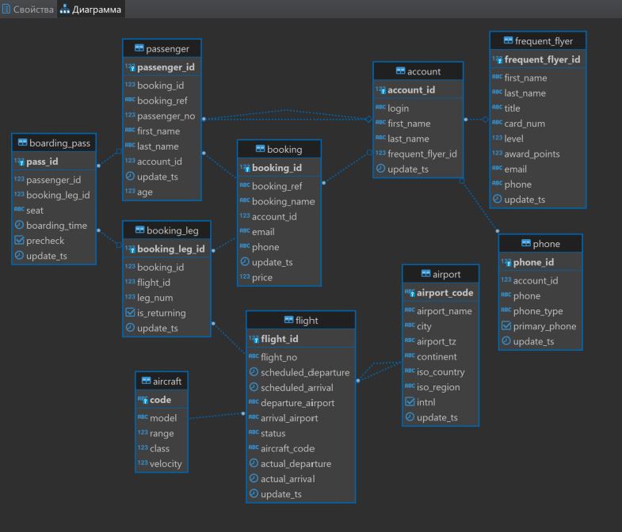

# Занятие 18 (Работа с индексами, join'ами, статистикой)

## вариант 1 (индексы)

* Создать индекс к какой-либо из таблиц вашей БД

explain select al.item_id, al.item_name  from gkretail.alco_item al where al.net_weight = 0.1;

    Seq Scan on alco_item al  (cost=0.00..150.53 rows=19 width=54)

        Filter: (net_weight = 0.1)
  
create index "al_weight" on gkretail.alco_item (net_weight);

--**не уникальный индекс для объёма бутылки**

* Прислать текстом результат команды explain, в которой используется данный индекс

explain select al.item_id, al.item_name  from gkretail.alco_item al where al.net_weight = 0.1;

    Bitmap Heap Scan on alco_item al  (cost=4.43..53.98 rows=19 width=54)

        Recheck Cond: (net_weight = 0.1)

            ->  Bitmap Index Scan on al_weight  (cost=0.00..4.42 rows=19 width=0)

                Index Cond: (net_weight = 0.1)

* Реализовать индекс для полнотекстового поиска

alter table gkretail.alco_item add column full_name_lexeme tsvector;

update gkretail.alco_item set full_name_lexeme = to_tsvector(item_full_name) ;

create index alco_full_name_gin on gkretail.alco_item using gin (full_name_lexeme);

--**полнотекстовый поиск по полному названию продукции**

explain select al.item_full_name  from gkretail.alco_item al where al.full_name_lexeme @@ to_tsquery('вино');

    Bitmap Heap Scan on alco_item al  (cost=20.97..589.28 rows=1125 width=131)

        Recheck Cond: (full_name_lexeme @@ to_tsquery('вино'::text))

            ->  Bitmap Index Scan on alco_full_name_gin  (cost=0.00..20.69 rows=1125 width=0)

                Index Cond: (full_name_lexeme @@ to_tsquery('вино'::text))

* Реализовать индекс на часть таблицы или индекс на поле с функцией

create index shelf_life_idx on gkretail.alco_item (shelf_life) where shelf_life < 9999;

--**индекс на срок годности в днях**

explain select * from gkretail.alco_item al where al.shelf_life < 365;

    Bitmap Heap Scan on alco_item al  (cost=10.97..302.90 rows=348 width=409)

        Recheck Cond: (shelf_life < 365)
	
            ->  Bitmap Index Scan on shelf_life_idx  (cost=0.00..10.89 rows=348 width=0)

                Index Cond: (shelf_life < 365)

* Создать индекс на несколько полей

create index weight_and_qty_idx on gkretail.alco_item (net_weight,qty_alco_set);

--**индекс на объем бутылки количество таких бутылок в упаковке**

explain select al.item_id, al.item_name  from gkretail.alco_item al where al.net_weight = 0.5 and al.qty_alco_set = 2;

    Bitmap Heap Scan on alco_item al  (cost=4.31..15.41 rows=3 width=54)

        Recheck Cond: ((net_weight = 0.5) AND (qty_alco_set = 2))

            ->  Bitmap Index Scan on weight_and_qty_idx  (cost=0.00..4.31 rows=3 width=0)

                Index Cond: ((net_weight = 0.5) AND (qty_alco_set = 2))

## вариант 2 (соединения)
**использовалась БД postgres_air**

* Реализовать простое соединение двух или более таблиц

select ac.model, fl.flight_no, fl.departure_airport , fl.arrival_airport from postgres_air.aircraft ac inner join postgres_air.flight fl on ac.code = fl.aircraft_code;

--**указываем модель самолета в каждом рейсе**

* Реализовать левостороннее (или правостороннее) соединение двух или более таблиц

select * from postgreselect * from postgres_air.account acc left outer join postgres_air.frequent_flyer ffl on acc.frequent_flyer_id = ffl.frequent_flyer_id;

--**выборка всех аккаунтов с указанием продвинутого пассажира**

* Реализовать кросс соединение двух или более таблиц

select * from postgres_air.airport ap, postgres_air.aircraft af;

--**сопоставление всех аэропортов со всеми самолетами, чтобы в результате была строчка для каждого самолета в каждом аэропорту**

* Реализовать полное соединение двух или более таблиц

select * from postgres_air.passenger pas full join postgres_air.account acc on pas.account_id = acc.account_id;

--**выборка всех пассажиров и всех аккаунтов, по возможности связав их между собой**

* Реализовать запрос, в котором будут использованы разные типы соединений

select pas.passenger_id, pas.first_name, pas.last_name, phn.phone 

from

    postgres_air.passenger pas left outer join

	    postgres_air.account acc inner join 

		    postgres_air.phone phn 

		    on acc.account_id = phn.account_id 

	    on pas.account_id = acc.account_id 

    where pas.first_name = 'ACE' and pas.last_name = 'NO' ;

--**запрос пассажиров с фильтром по имени, и по возможности с телефонами из аккаунта**

