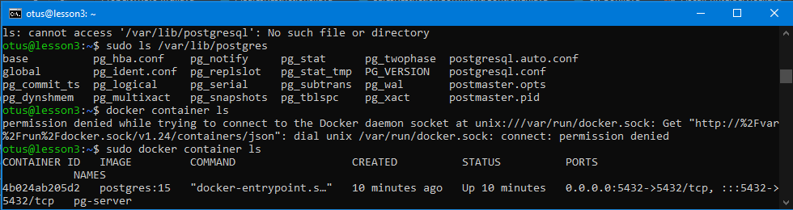
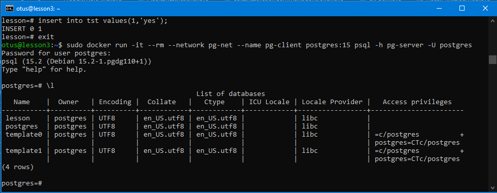
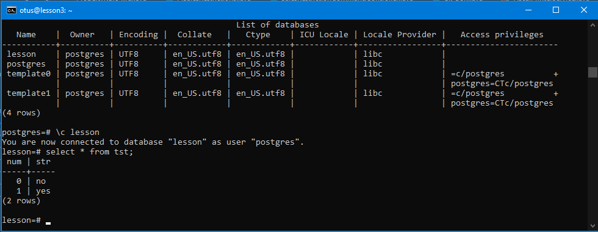
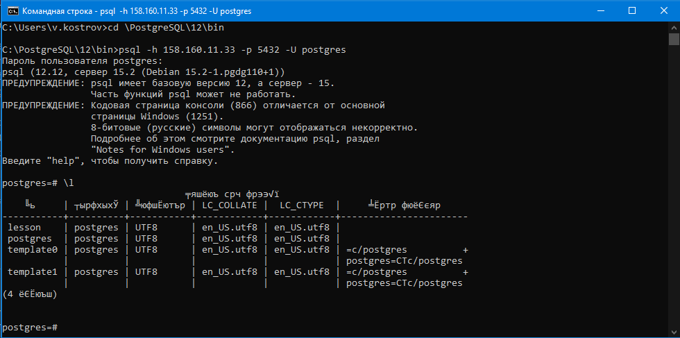
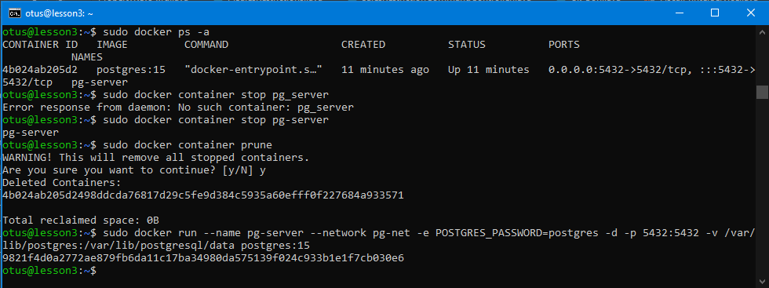
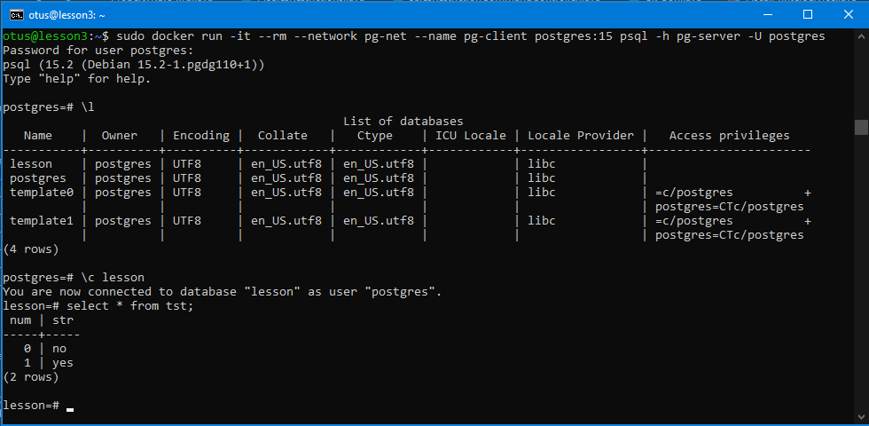

# Занятие 3 (Docker)
* создать ВМ с Ubuntu 20.04/22.04 или развернуть докер любым удобным способом

Yandex Cloud - Создано через Веб
* поставить на нем Docker Engine

curl -fsSL https://get.docker.com -o get-docker.sh && sudo sh get-docker.sh && rm get-docker.sh && sudo usermod -aG docker $USER
* сделать каталог /var/lib/postgres

sudo mkdir /var/lib/postgres
* развернуть контейнер с PostgreSQL 15 смонтировав в него /var/lib/postgresql

sudo docker network create pg-net

sudo docker run --name pg-server --network pg-net -e POSTGRES_PASSWORD=postgres -d -p 5432:5432 -v /var/lib/postgres:/var/lib/postgresql/data postgres:15

* развернуть контейнер с клиентом postgres
* подключится из контейнера с клиентом к контейнеру с сервером и сделать таблицу с парой строк

sudo docker run -it --rm --network pg-net --name pg-client postgres:15 psql -h pg-server -U postgres

* подключится к контейнеру с сервером с ноутбука/компьютера извне инстансов GCP/ЯО/места установки докера

* удалить контейнер с сервером
* создать его заново

* подключится снова из контейнера с клиентом к контейнеру с сервером

sudo docker run -it --rm --network pg-net --name pg-client postgres:15 psql -h pg-server -U postgres
* проверить, что данные остались на месте

