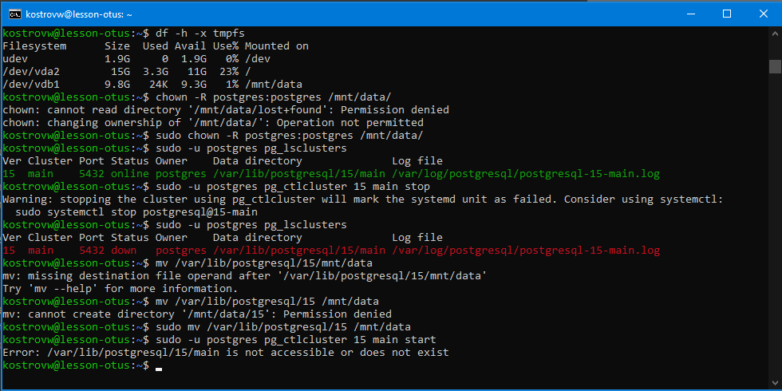

# Занятие 6 (Физический уровень PostgreSQL)
* создайте виртуальную машину c Ubuntu 20.04/22.04 LTS в GCE/ЯО/Virtual Box/докере
* поставьте на нее PostgreSQL 15 через sudo apt
* проверьте что кластер запущен через sudo -u postgres pg_lsclusters
* зайдите из под пользователя postgres в psql и сделайте произвольную таблицу с произвольным содержимым

postgres=# create table test(c1 text);

postgres=# insert into test values('1');

\q

* остановите postgres например через sudo -u postgres pg_ctlcluster 15 main stop

* создайте новый диск к ВМ размером 10GB
* добавьте свеже-созданный диск к виртуальной машине - надо зайти в режим ее редактирования и дальше выбрать пункт attach existing disk
* проинициализируйте диск согласно инструкции и подмонтировать файловую систему, только не забывайте менять имя диска на актуальное, в вашем случае это скорее всего будет /dev/sdb - https://www.digitalocean.com/community/tutorials/how-to-partition-and-format-storage-devices-in-linux

* перезагрузите инстанс и убедитесь, что диск остается примонтированным (если не так смотрим в сторону fstab)

* сделайте пользователя postgres владельцем /mnt/data - chown -R postgres:postgres /mnt/data/
* перенесите содержимое /var/lib/postgres/15 в /mnt/data - mv /var/lib/postgresql/15/mnt/data
* попытайтесь запустить кластер - sudo -u postgres pg_ctlcluster 15 main start

* **напишите получилось или нет и почему**

**не получилось, потому что данных кластера на месте нет. мы их перенесли на другой путь**

* задание: найти конфигурационный параметр в файлах раположенных в /etc/postgresql/15/main который надо поменять и поменяйте его
* **напишите что и почему поменяли**

**data_directory = '/var/lib/postgresql/15/main'          # use data in another directory**

**заменил на**

**data_directory = '/mnt/data/15/main'          # use data in another directory**

* попытайтесь запустить кластер - sudo -u postgres pg_ctlcluster 15 main start
* напишите получилось или нет и почему

**получилось - путь к данным кластера теперь правильный**

* зайдите через через psql и проверьте содержимое ранее созданной таблицы

* **задание со звездочкой** *: не удаляя существующий инстанс ВМ сделайте новый, поставьте на его PostgreSQL, удалите файлы с данными из /var/lib/postgres, перемонтируйте внешний диск который сделали ранее от первой виртуальной машины ко второй и запустите PostgreSQL на второй машине так чтобы он работал с данными на внешнем диске, расскажите как вы это сделали и что в итоге получилось.

**первая vm**
sudo -u postgres pg_ctlcluster 15 main stop

sudo umount /dev/vdb1

исключил из fstab

отсоединил диск

**вторая vm**

установил postgres

sudo -u postgres pg_ctlcluster 15 main stop

sudo rm -r /var/lib/postgresql/15

присоединил отдельный диск

sudo mkdir -p /mnt/data

sudo mount -o defaults /dev/vdb1 /mnt/data

включил в fstab

sudo nano /etc/postgresql/15/main/postgresql.conf

data_directory = '/mnt/data/15/main'          # use data in another directory

sudo -u postgres pg_ctlcluster 15 main start

**каталог с данными подключен к кластеру на новой ВМ и кластер работает.**

