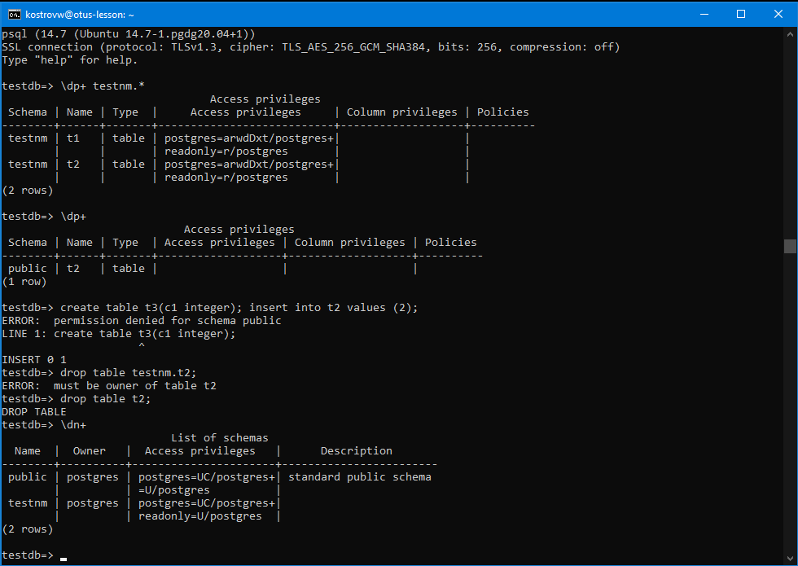

# Занятие 7 (Логический уровень)
1 создайте новый кластер PostgresSQL 14

2 зайдите в созданный кластер под пользователем postgres

sudo -u postgres psql

3 создайте новую базу данных testdb

CREATE DATABASE testdb;

4 зайдите в созданную базу данных под пользователем postgres

sudo -u postgres psql -U postgres -d testdb

5 создайте новую схему testnm

CREATE SCHEMA testnm;

6 создайте новую таблицу t1 с одной колонкой c1 типа integer

CREATE TABLE t1(c1 INTEGER);

7 вставьте строку со значением c1=1

INSERT INTO t1 (c1)VALUES(1);

8 создайте новую роль readonly

CREATE ROLE readonly;

9 дайте новой роли право на подключение к базе данных testdb.

GRANT CONNECT ON DATABASE testdb TO readonly;

10 дайте новой роли право на использование схемы testnm

GRANT USAGE ON SCHEMA testnm TO readonly;

11 дайте новой роли право на select для всех таблиц схемы testnm

GRANT SELECT ON ALL TABLES IN SCHEMA testnm TO readonly;

12 создайте пользователя testread с паролем test123

CREATE USER testread PASSWORD 'test123';

13 дайте роль readonly пользователю testread

GRANT readonly TO testread;

14 зайдите под пользователем testread в базу данных testdb

psql -h localhost -U testread -d testdb

15 сделайте select * from t1;

16 получилось? (могло если вы делали сами не по шпаргалке и не упустили один существенный момент про который позже)

нет

17 напишите что именно произошло в тексте домашнего задания

ERROR:  permission denied for table t1

доступ к таблице запрещен

18 у вас есть идеи почему? ведь права то дали?

таблица t1 создана в схеме public и другим владельцем

19 посмотрите на список таблиц

20 подсказка в шпаргалке под пунктом 20

21 а почему так получилось с таблицей (если делали сами и без шпаргалки то может у вас все нормально)

потому что таблицу создавали без имени схемы

22 вернитесь в базу данных testdb под пользователем postgres

23 удалите таблицу t1

DROP TABLE t1;

24 создайте ее заново но уже с явным указанием имени схемы testnm

CREATE TABLE testnm.t1(c1 INTEGER);

25 вставьте строку со значением c1=1

INSERT INTO testnm.t1 (c1)VALUES(1);

26 зайдите под пользователем testread в базу данных testdb

27 сделайте select * from testnm.t1;

28 получилось?

нет

ERROR:  permission denied for table t1

29 есть идеи почему? если нет - смотрите шпаргалку

таблица создана после раздачи прав. на неё розданные ранее права не распространились.

30 как сделать так чтобы такое больше не повторялось? если нет идей - смотрите шпаргалку

повторить выдачу прав под postgres для сущестующих таблиц

GRANT SELECT ON ALL TABLES IN SCHEMA testnm TO readonly;

разрешить выдачу прав для новых таблиц

ALTER DEFAULT PRIVILEGES IN SCHEMA testnm GRANT SELECT ON TABLES TO readonly;

создал новую таблицу для проверки

create table testnm.t2(c1 integer); insert into testnm.t2 values (2);

31 сделайте select * from testnm.t1;

32 получилось?

да

33 ура!

34 теперь попробуйте выполнить команду create table t2(c1 integer); insert into t2 values (2);

35 а как так? нам же никто прав на создание таблиц и insert в них под ролью readonly?

мы создали таблицу не в testnm, а в public, туда разрешения есть по умолчанию для роли public

36 есть идеи как убрать эти права? если нет - смотрите шпаргалку

REVOKE CREATE ON SCHEMA public FROM public;

37 если вы справились сами то расскажите что сделали и почему, если смотрели шпаргалку - объясните что сделали и почему выполнив указанные в ней команды

права на создание в схеме public нельзя отозвать для определенной роли, поскольку они наследуются. значит нужно отозвать права для самой роли public

38 теперь попробуйте выполнить команду create table t3(c1 integer); insert into t2 values (2);

39 расскажите что получилось и почему

получилось запретить создание таблиц в схеме public. таблица public.t2 уже создана доступна для записи роли-владельцу.
 Ей можно также отозвать права на чтение через схему public, но такой отзыв прав подействует на все роли

