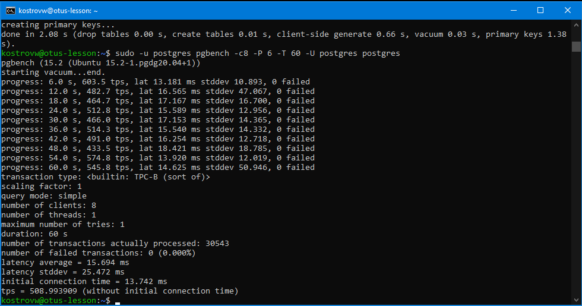
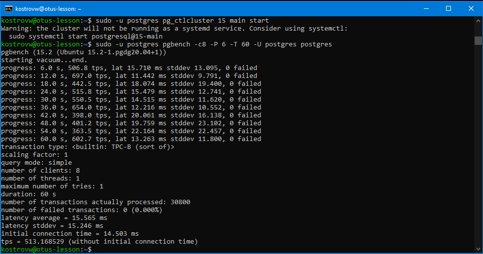
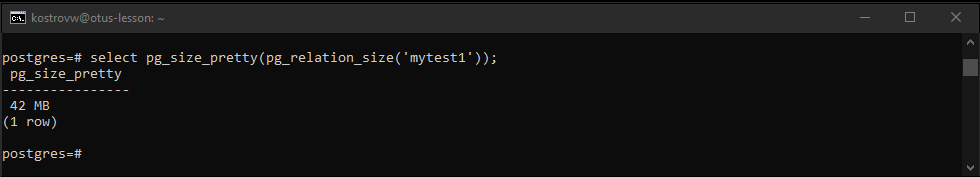
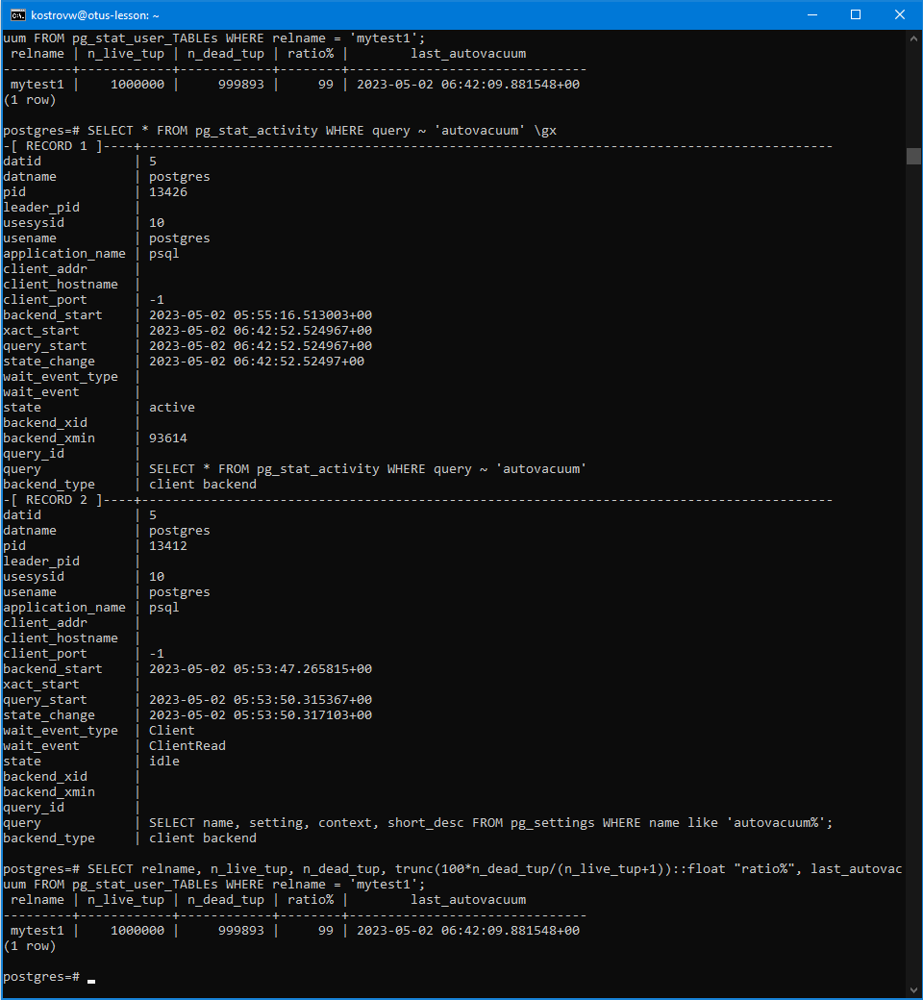
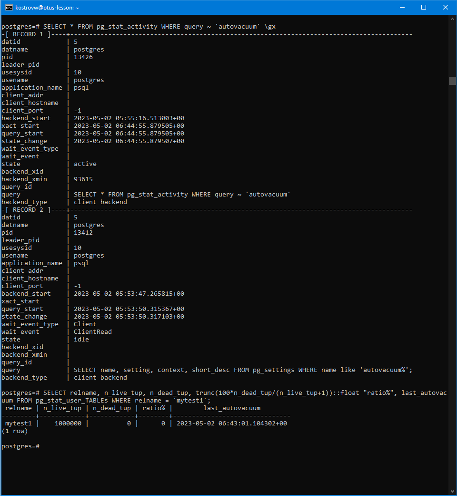
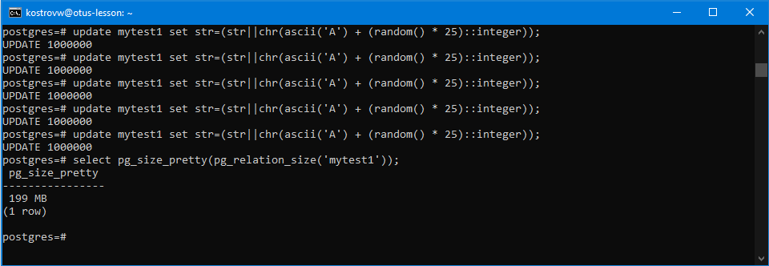
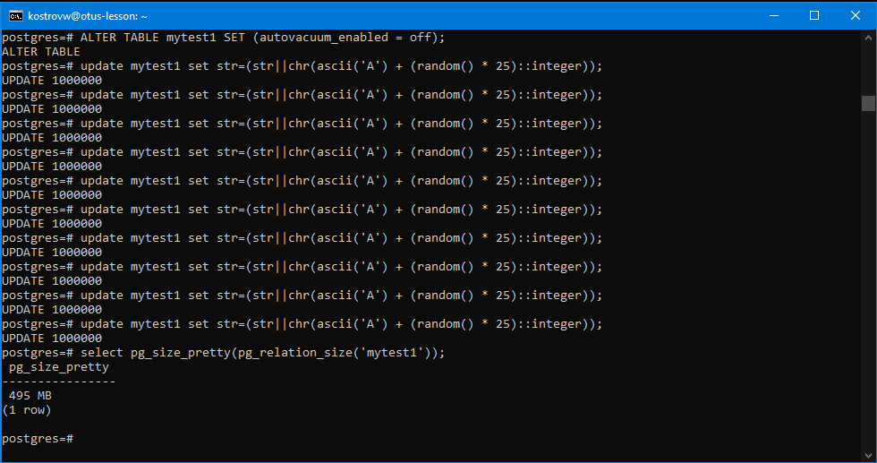
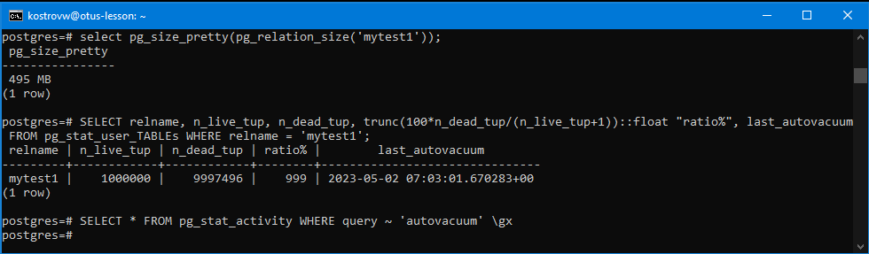

#Занятие 8 (vacuum и autovacuum)
* Создать инстанс ВМ с 2 ядрами и 4 Гб ОЗУ и SSD 10GB
* Установить на него PostgreSQL 15 с дефолтными настройками
* Создать БД для тестов: выполнить pgbench -i postgres

sudo -u postgres pgbench -i postgres

* Запустить pgbench -c8 -P 6 -T 60 -U postgres postgres

sudo -u postgres pgbench -c8 -P 6 -T 60 -U postgres postgres

* Применить параметры настройки PostgreSQL из прикрепленного к материалам занятия файла

sudo nano /var/lib/postgresql/15/main/postgresql.auto.conf

sudo -u postgres pg_ctlcluster 15 main stop

sudo -u postgres pg_ctlcluster 15 main start

* Протестировать заново

* Что изменилось и почему?

почти ничего, только уменьшилось stddev

на ВМ в облаке достаточно ресурсов, чтобы выполнить оба бенчмарка в обоих случаях

* Создать таблицу с текстовым полем и заполнить случайными или сгенерированными данным в размере 1млн строк

create table mytest(str Varchar(25));

INSERT INTO mytest1(str) SELECT substr(md5(random()::text), 0, 10) FROM generate_series(1,1000000);

* Посмотреть размер файла с таблицей

 select pg_size_pretty(pg_relation_size('mytest1'));

* 5 раз обновить все строчки и добавить к каждой строчке любой символ

update mytest1 set str=(str||chr(ascii('A') + (random() * 25)::integer));

* Посмотреть количество мертвых строчек в таблице и когда последний раз приходил автовакуум

SELECT relname, n_live_tup, n_dead_tup, trunc(100*n_dead_tup/(n_live_tup+1))::float "ratio%", last_autovacuum FROM pg_stat_user_TABLEs WHERE relname = 'mytest1';

SELECT * FROM pg_stat_activity WHERE query ~ 'autovacuum' \gx

* Подождать некоторое время, проверяя, пришел ли автовакуум

* 5 раз обновить все строчки и добавить к каждой строчке любой символ
* Посмотреть размер файла с таблицей

* Отключить Автовакуум на конкретной таблице

ALTER TABLE mytest1 SET (autovacuum_enabled = off);

* 10 раз обновить все строчки и добавить к каждой строчке любой символ
* Посмотреть размер файла с таблицей

* Объясните полученный результат

В первом тесте автовакуум запускался после четвертого прогона апдейта.
 Во втором тесте новые записи создавались без увеличения таблицы, на месте прежних мертвых.
 Во 10-кратном случае все апдейты сложили свои мертвые записи.

* Не забудьте включить автовакуум)

ALTER TABLE mytest1 SET (autovacuum_enabled = on);

* Задание со *:
Написать анонимную процедуру, в которой в цикле 10 раз обновятся все строчки в искомой таблице.
Не забыть вывести номер шага цикла.