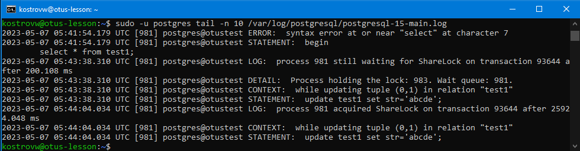
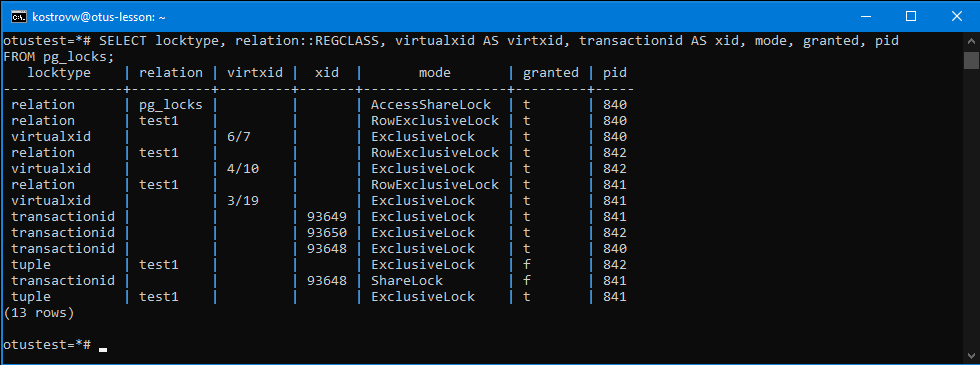
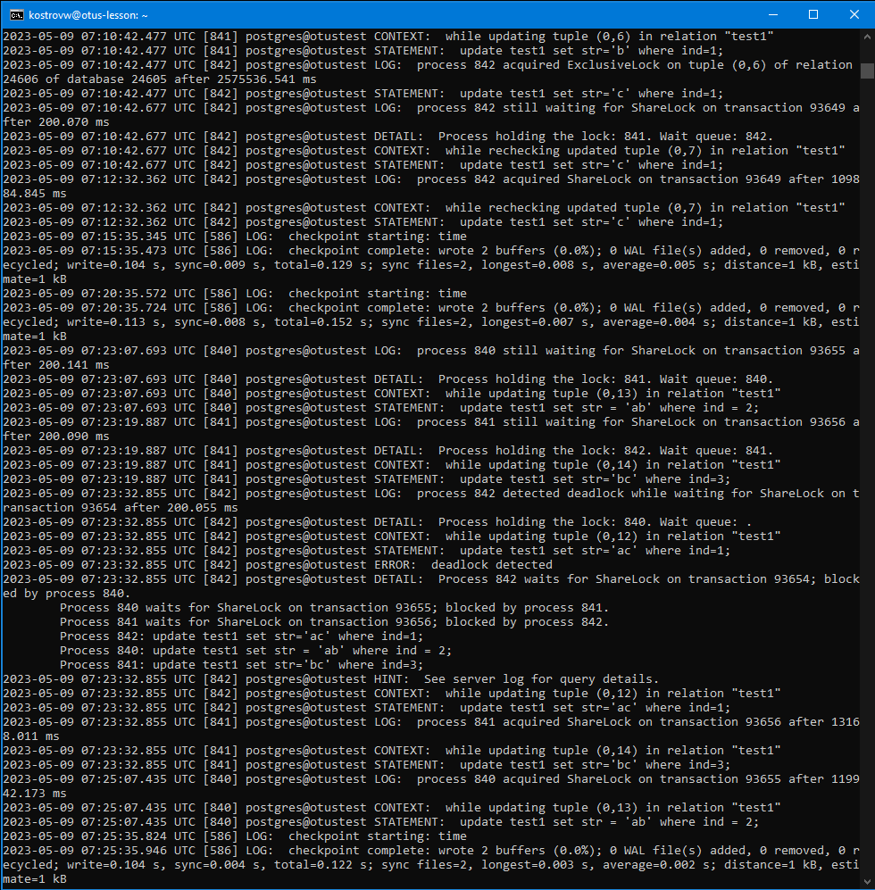

# Занятие 9 (блокировки)
1 Настройте сервер так, чтобы в журнал сообщений сбрасывалась информация о блокировках, удерживаемых более 200 миллисекунд. Воспроизведите ситуацию, при которой в журнале появятся такие сообщения.

alter system set deadlock_timeout = 200;

ALTER SYSTEM SET log_lock_waits = on;

SELECT pg_reload_conf();

* session 1

create table test1(ind int, str varchar(25));

insert into test1(1,'abc');

begin;

insert into test1 values(1,'abc');

* session 2

begin;

update test1 set str='abcd';

* session 1

update test1 set str='abcde';

* session 2

commit;

* session 1

commit;

2 Смоделируйте ситуацию обновления одной и той же строки тремя командами UPDATE в разных сеансах. Изучите возникшие блокировки в представлении pg_locks и убедитесь, что все они понятны. Пришлите список блокировок и объясните, что значит каждая.

relation      | pg_locks |         |       | AccessShareLock  | t       | 840

перый сеанс - блокировка на представление pg_locks

relation      | test1    |         |       | RowExclusiveLock | t       | 840

первый сеанс - исключительная блокировка на update таблицы

virtualxid    |          | 6/7     |       | ExclusiveLock    | t       | 840

первый сеанс - исключительная блокировка на виртуальный номер транзакции

relation      | test1    |         |       | RowExclusiveLock | t       | 842

третий сеанс - исключительная блокировка на update таблицы

virtualxid    |          | 4/10    |       | ExclusiveLock    | t       | 842

третий сеанс - исключительная блокировка на виртуальный номер транзакции

relation      | test1    |         |       | RowExclusiveLock | t       | 841

второй сеанс - исключительная блокировка на update таблицы

virtualxid    |          | 3/19    |       | ExclusiveLock    | t       | 841

второй сеанс - исключительная блокировка на виртуальный номер транзакции

transactionid |          |         | 93649 | ExclusiveLock    | t       | 841

второй сеанс - исключительная блокировка на настоящий номер транзакции

transactionid |          |         | 93650 | ExclusiveLock    | t       | 842

третий сеанс - исключительная блокировка на настоящий номер транзакции

transactionid |          |         | 93648 | ExclusiveLock    | t       | 840
 
первый сеанс - исключительная блокировка на настоящий номер транзакции
 
tuple         | test1    |         |       | ExclusiveLock    | f       | 842
 
третий сеанс - не может получить исключительную блокировку на строку таблицы

transactionid |          |         | 93648 | ShareLock        | f       | 841

второй сеанс - блокировка на номер транзакции из первого сеанса (ожидает её завершения)

tuple         | test1    |         |       | ExclusiveLock    | t       | 841

второй сеанс - исключительная блокировка на строку таблицы, измененную первой транзакцией

3 Воспроизведите взаимоблокировку трех транзакций. Можно ли разобраться в ситуации постфактум, изучая журнал сообщений?

В журнале присутствует информация о deadlock и приведших к нему командах и транзакциях

4 Могут ли две транзакции, выполняющие единственную команду UPDATE одной и той же таблицы (без where), заблокировать друг друга?

такого быть не должно, поскольку первая транзакция при попытке выполнения команды захватит небходимые блокировки и вторая транзакция со своей командой окажется в очереди за ней
